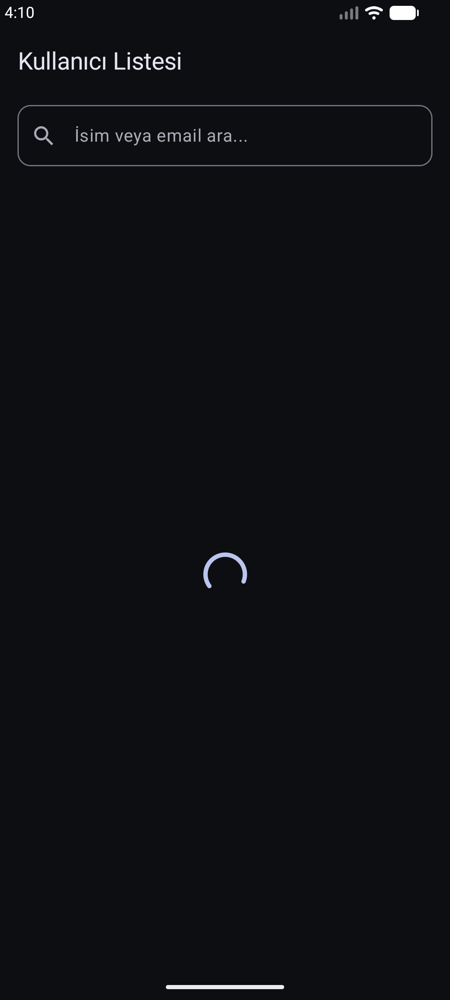
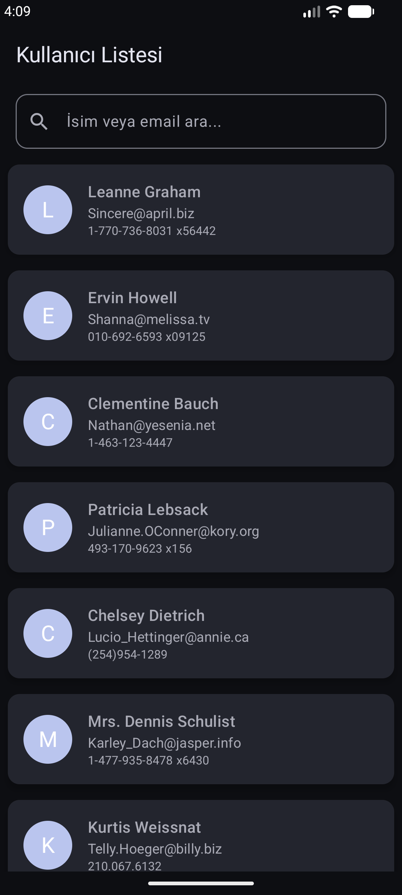
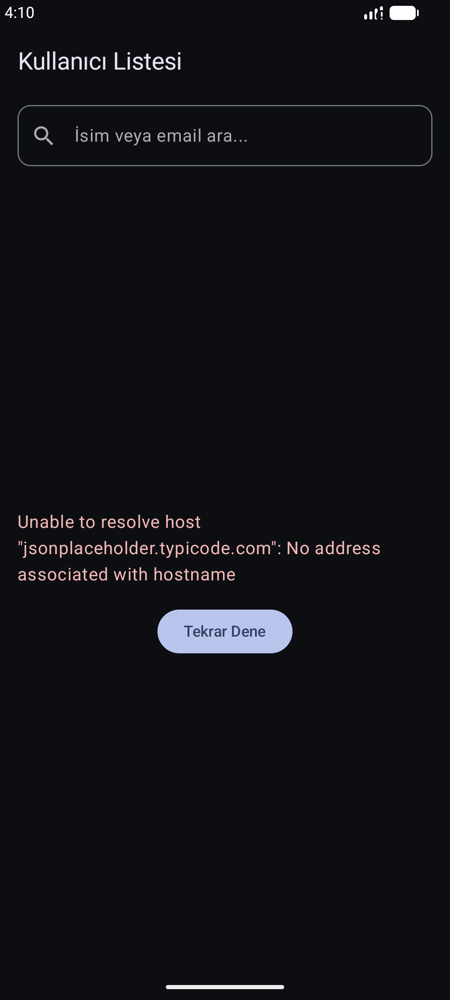
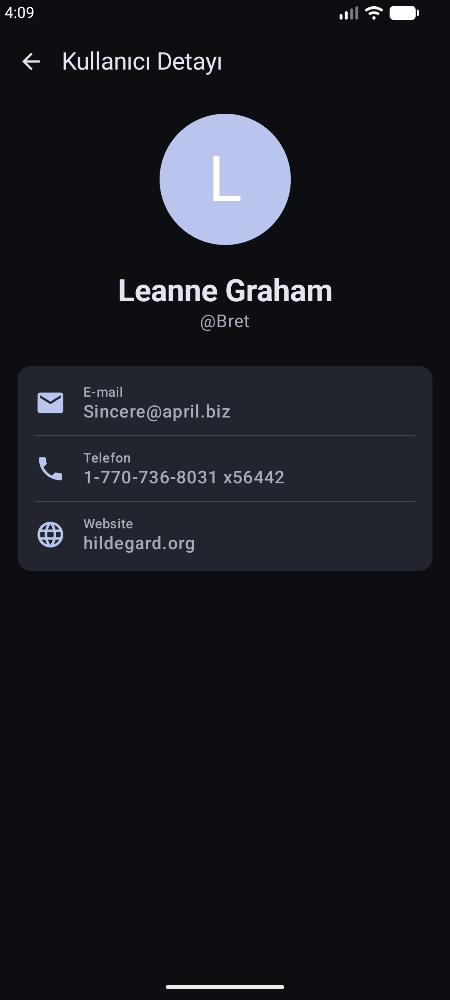
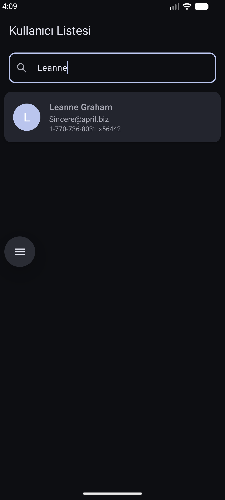

# Kullanıcı Listesi Uygulaması

Bu proje, JSONPlaceholder API üzerinden kullanıcı verilerini çekerek gösteren, modern Android geliştirme standartlarına uygun olarak hazırlanmış bir Android uygulamasıdır.

## Kullanılan Teknolojiler

* Kotlin
* Jetpack Compose (Modern UI tasarımı)
* MVVM Mimarisi (Katı katman ayrımı)
* StateFlow ve Coroutines (Asenkron işlemler ve Reaktif durum yönetimi)
* Retrofit ve Gson (API entegrasyonu ve JSON dönüşümü)
* Navigation Compose (Sayfalar arası yönlendirme - Bonus Bölüm)

## Proje Mimarisi

Proje MVVM mimarisi etrafında şekillenmiş olup, veri katmanı (data), arayüz katmanı (ui) ve iş mantığı (viewmodel) olarak üç ana bölüme ayrılmıştır. Proje içerisinde arama yapma ve detay sayfasına gitme gibi ek özellikler mevcuttur.

## Kurulum Adımları

1. Bu projeyi bilgisayarınıza klonlayın veya ZIP formatıyla indirin.
2. Proje klasörünü Android Studio üzerinden açın.
3. "Sync Project with Gradle Files" işlemine izin vererek bağımlılıkların indirilmesini bekleyin.
4. Uygulamayı derlemek ve çalıştırmak için üst barda bulunan yeşil "Run" butonuna (Shift + F10) basın.
5. Uygulamayı Android Emulator veya fiziksel bir cihaz üzerinde test edebilirsiniz. (İnternet bağlantınız olduğuna emin olun).

## Ekran Görüntüleri

Yükleniyor, liste, hata, detay ve arama ekranlarına ait ekran görüntüleri:

### Yükleniyor (Loading)

### Başarılı Liste (Success)

### Hata (Error)

### Kullanıcı Detayı

### İsim & E-mail ile Arama

